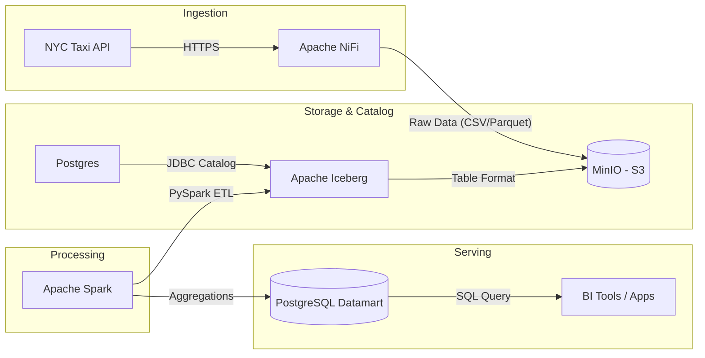

# Modern Data Lakehouse local (Data Mesh approach) 🚀


This project demonstrates a production-grade **Modern Data Lakehouse** architecture running entirely on a local Dockerized environment. It handles high-volume data ingestion, scalable processing, and efficient serving using the latest industry standards.

## 🏗️ Architecture



## 🛠️ Tech Stack

-   **Storage**: [MinIO](https://min.io/) (S3-compatible Object Storage)
-   **Table Format**: [Apache Iceberg](https://iceberg.apache.org/) (for ACID transactions on the data lake)
-   **Ingestion**: [Apache NiFi](https://nifi.apache.org/) (for robust, GUI-driven data flows)
-   **Compute**: [Apache Spark 3.5](https://spark.apache.org/) (High-performance distributed processing)
-   **Serving**: [PostgreSQL](https://www.postgresql.org/) (Reliable relational datamart)
-   **Orchestration**: [Docker Compose](https://docs.docker.com/compose/)

## 🌟 Key Features

-   **ACID Compliance**: Leverages Apache Iceberg to bring database-like reliability (Atomicity, Consistency, Isolation, Durability) to S3 storage.
-   **Scalable Ingestion**: Uses a dynamic NiFi approach to ingest multiple data sources (NYC Taxi datasets) with minimal configuration.
-   **Data Mesh Optimized**: Designed with domain-driven principles, separating ingestion, processing, and serving layers.
-   **Schema Evolution**: Full support for evolving data structures without breaking downstream pipelines.

## 🚀 Quick Start

### 1. Launch Infrastructure
```bash
docker-compose up -d --build
```

### 2. Ingest Data
Access NiFi at `https://localhost:8443/nifi` and start the ingestion flow (or use the provided `simulate_ingestion.py` script).

### 3. Run ETL Jobs
Submit the Spark jobs to transform raw data into Iceberg and then into the final Datamart:
```bash
# Ingest to Iceberg
./submit_job.sh /opt/bitnami/spark/jobs/ingest_raw_to_iceberg.py

# Compute Datamart
./submit_job.sh /opt/bitnami/spark/jobs/compute_datamart.py
```

## 📊 Demonstrated Skills

-   **Distributed Computing**: Managing Spark clusters and optimizing PySpark jobs.
-   **Data Lakehouse Design**: Implementing Open Table Formats (Iceberg) for scalable storage.
-   **Object Storage**: Managing S3 buckets, permissions, and lifecycle.
-   **ETL/ELT Pipelines**: Building end-to-end flows with modern tools.
-   **Infrastructure as Code**: Orchestrating complex stacks with Docker.


