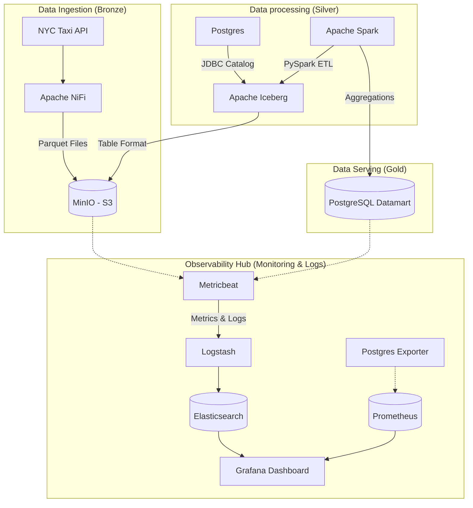

# Modern Data Lakehouse local (Data Mesh approach) 🚀


This project demonstrates a production-grade **Modern Data Lakehouse** architecture running entirely on a local Dockerized environment. It handles high-volume data ingestion, scalable processing, efficient serving, and **full-stack observability** using the latest industry standards.

## 🏗️ Architecture



## 🛠️ Tech Stack

### Data Platform
-   **Storage**: [MinIO](https://min.io/) (S3-compatible Object Storage)
-   **Table Format**: [Apache Iceberg](https://iceberg.apache.org/) (ACID transitions on the lake)
-   **Ingestion**: [Apache NiFi](https://nifi.apache.org/) (GUI-driven dynamic flows)
-   **Compute**: [Apache Spark 3.5](https://spark.apache.org/) (Distributed PySpark processing)
-   **Serving**: [PostgreSQL](https://www.postgresql.org/) (Relational datamart)

### Observability Hub
-   **Logs**: [ELK Stack](https://www.elastic.co/elastic-stack) (Elasticsearch, Logstash, Metricbeat)
-   **Metrics**: [Prometheus](https://prometheus.io/) & [Postgres Exporter](https://github.com/prometheus-community/postgres_exporter)
-   **Visualization**: [Grafana](https://grafana.com/) (Centralized Monitoring)

## 🌟 Key Features

-   **ACID Data Lake**: Database-like reliability on S3 storage using Iceberg.
-   **Full Observability**: Real-time monitoring of container health, database performance, and ETL logs.
-   **Data Mesh Principles**: Domain-driven separation between ingestion, processing, and serving.
-   **Automated Provisioning**: Grafana is pre-configured with Prometheus and Elasticsearch data sources.

## 🚀 Quick Start

### 1. Launch Infrastructure
```bash
# Ensure you have at least 8GB of RAM available
docker-compose up -d --build
```

### 2. Ingest & Process
```bash
# Ingest to Iceberg (Silver Layer)
./submit_job.sh jobs/ingest_raw_to_iceberg.py

# Compute aggregations (Gold Layer)
./submit_job.sh jobs/compute_datamart.py
```

### 3. Monitor
-   **Grafana**: `http://localhost:3003` (admin / admin)
-   **Prometheus**: `http://localhost:9090`
-   **NiFi**: `https://localhost:8443/nifi`
-   **MinIO Console**: `http://localhost:9001`

## 📊 Demonstrated Skills

-   **Cloud Native Data Engineering**: Building scalable architectures with Docker & S3.
-   **Infrastructure Observability**: Implementing complete ELK and Prometheus/Grafana stacks.
-   **Distributed Processing**: Optimizing PySpark jobs for massive data volume.
-   **Open Table Formats**: Mastering Apache Iceberg for modern lakehouse design.


